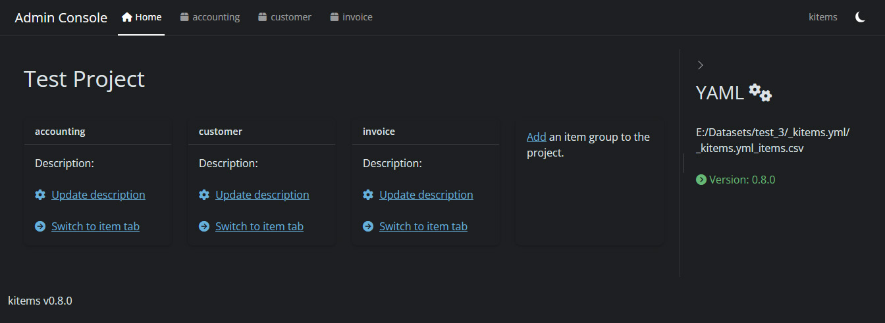
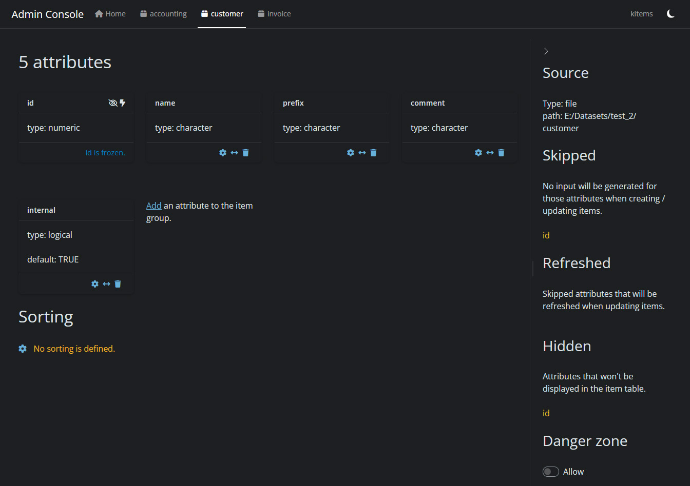

# Administration

The framework provides administration capabilities to cover data
governance tasks.

## Admin console

An administration console is delivered as a standalone Shiny app within
the package.

The main reason is that in most cases, it’s not recommended to have the
data governance accessible from within the application. Another reason
is that administration tasks are not expected to be performed on regular
basis. Therefore there is no need to have the main module server and the
session overloaded with reactives & observers that won’t be called.

To run the app, use the
[`admin()`](https://thekangaroofactory.github.io/kitems/reference/admin.md)
function:

``` r

kitems::admin()
```

The admin console gives access to all the data models declared in the
YAML config file.  
It will look for this file in the path defined by the `R_KITEMS_PATH`
environment variable.

### Features

#### Home

The admin console has been completely redesigned in version
[0.8.0](https://thekangaroofactory.github.io/kitems/news/index.html#kitems-v080).  
It now offers a home tab where to see all item groups related to the
project (the ones declared in the common YAML config file):



Home tab

#### Data governance

Each item group declared in the YAML file gets a specific tab:



Item specification

It contains all the specs defined for the item group:

- the attributes of the data model
- the sorting instruction
- where to find the data
- behaviors (ex. hidden attributes)
- a danger zone where to delete the item group.

##### Attributes

One of the benefits of having the data model stored in a YAML file is
that we don’t need to set a value for each parameter of an attribute.  
So the admin console only displays what has been set. (for ex. in the
above screenshot, `name` has no default but `internal` has one.)

> **Important**
>
> Each item group is created with a **mandatory** `id` attribute.  
> This attribute holds the unique key to identify a specific item in the
> group and can’t be updated[^1].

From there you can add attributes to the data model or update existing
ones thanks to the attribute wizard:


Attribute wizard

It is also possible to modify the order of the attributes to define the
order of the columns in the item table view (use the double arrow icon
in the footer of the attribute card).

##### Sorting

The tab also displays the sorting instruction(s) and allows to configure
it:


Sorting items UI

This will affect the order of the items displayed in the item (table)
view.

- multiple rules are allowed
- both ascending/descending order are supported

> **Note**
>
> There is no limit set to the number of rules you can define, but
> sorting affects the performance (more rules & more items leads to more
> computation time) so it’s recommended to stick with one or two rules.

##### Danger zone

The danger zone toggle (at the bottom of the sidebar) allows access to
actions that cannot be undone.  
At this time, it will only display the delete item group button.

> **Caution**
>
> Deleting an item group will delete the corresponding data model in the
> YAML file as well as the item file! It is recommended to perform a
> backup before.

### Initialization

When the console detects no YAML config file in the given path, you will
be asked if you want to create a one:


No YAML detected

### Migration

From version
[0.8.0](https://thekangaroofactory.github.io/kitems/news/index.html#kitems-v080),
data governance is carried by a unique YAML config file for the project.

If the admin console detects older data model files in the path, it will
perform the migration to the YAML format:


Migration required UI

Once the migration is done, a report will be displayed:


Migration done UI

Old data models are archived in a backup directory corresponding to
their version (ex. backup_0_7_2).

> **Tip**
>
> It is recommended to run the admin console after a package upgrade to
> check whether a migration is needed or not.
>
> It is also recommended to check the
> [changelog](https://thekangaroofactory.github.io/kitems/news/index.md)
> page.

## Useful Links

- Data model – [core
  concepts](https://thekangaroofactory.github.io/kitems/articles/core-concepts.html#data-model)

[^1]: It may be possible to set a custom default function in the future,
    but this feature is not implemented yet.
