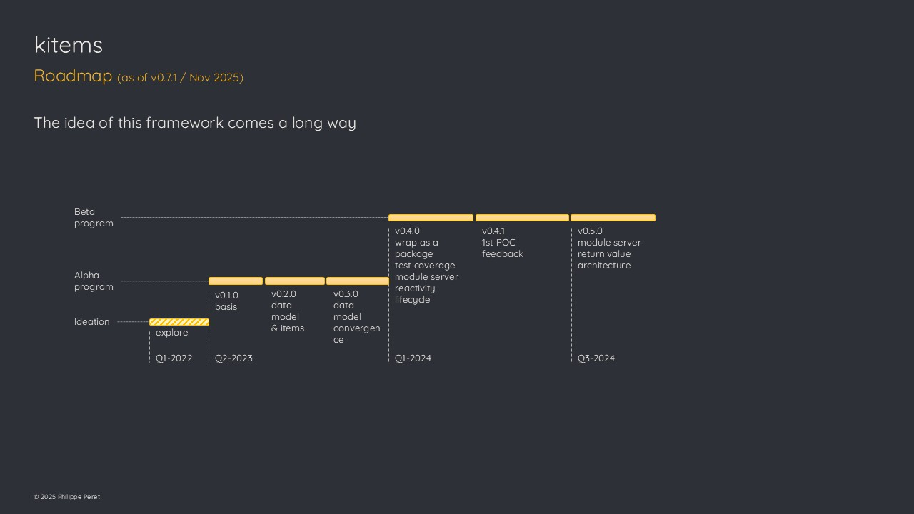

# Roadmap

As the package is still under convergence at the time of this version
(lifecycle = experimental), the roadmap here shows the progress that
were made as well as the next step.

## History

The motivations behind this package and the whole framework approach
came in 2020, but code exploration really started early 2022.

Once the proof of concept phase was closed, many development were
delivered throughout 2024 as more time could be spent on the project.

## Where we are

Since 2025, focus has been put on deep work to improve the architecture,
communication, workflows & performances. Also long time expected
features (like filtering) are delivered.

## What’s next

As the package gets more strength and has been widely tested in real
life use cases, it is now time to deliver all the necessary materials to
support its promotion.

