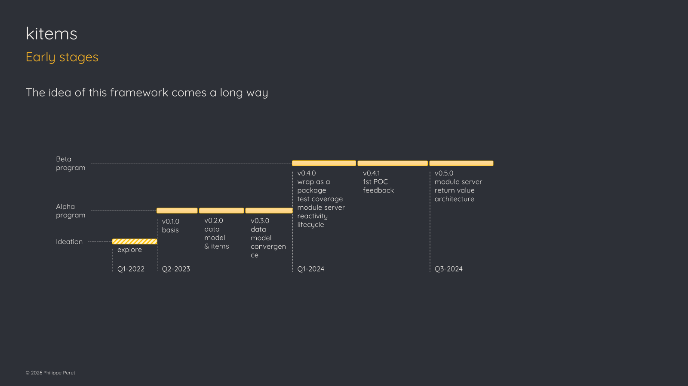
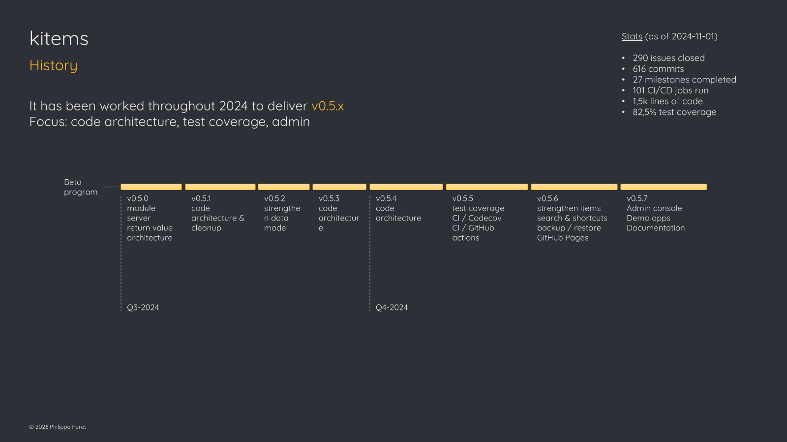
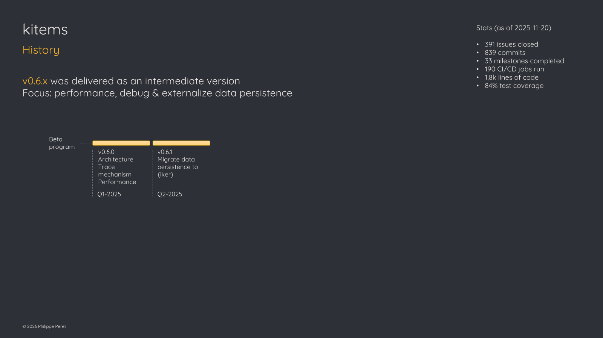
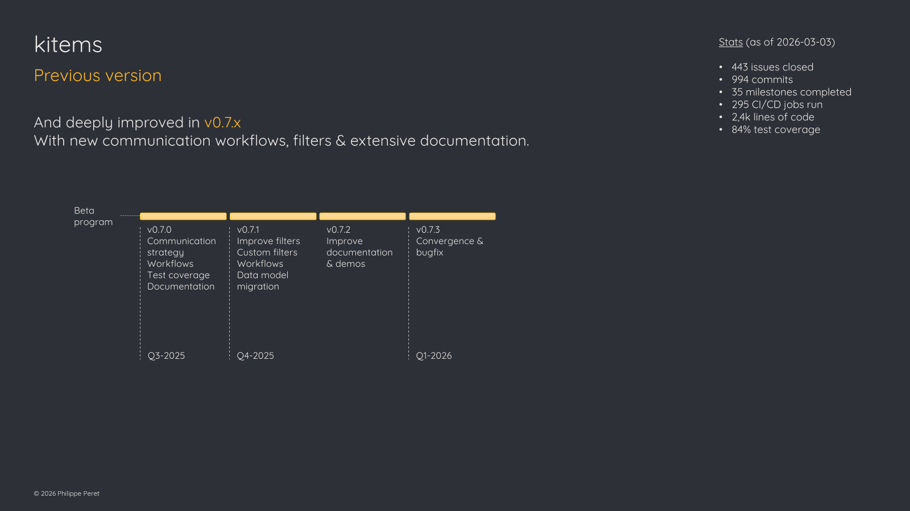
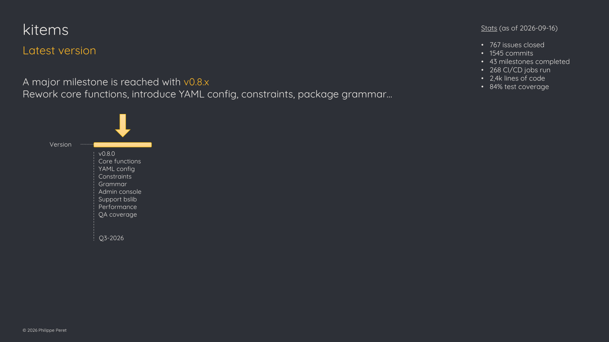
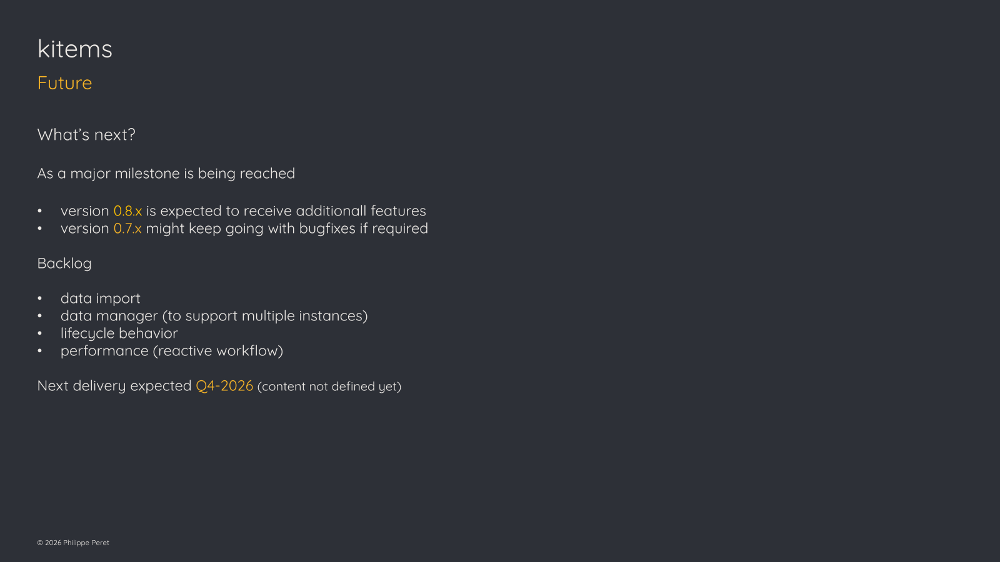

# Roadmap

This article shows the progress that were made as well as the next steps
on the roadmap.

## History

The motivations behind this package and the whole framework approach
came in 2020, but code exploration really started early 2022 after I
faced additional examples where such a tool would make the use cases
either achievable or less expensive.

Once the proof of concept phase was closed, many development were
delivered throughout 2024 as more time could be spent on the project.

## Previous version

Version
[0.7.0](https://thekangaroofactory.github.io/kitems/news/index.html#kitems-v070-beta)
has introduced many improvements around communication, workflow &
filters.

## Where we are

The latest version
[0.8.0](https://thekangaroofactory.github.io/kitems/news/index.html#kitems-v080)
found its motivation from limitations that came with early stage options
(data.frame storage for the data model), features that were not
compatible with the current state without deep rework as well as use
cases that were bring by deploying the previous version across apps.

In particular, the need for a package grammar to split core functions
from say use cases driven functions has open brand new horizons for the
package.

## What’s next

As the package gets more strength and has been widely tested, it is now
time to deliver continuous improvement on top of version
[0.8.0](https://thekangaroofactory.github.io/kitems/news/index.html#kitems-v080)
to take benefits from the core review that has been done.

