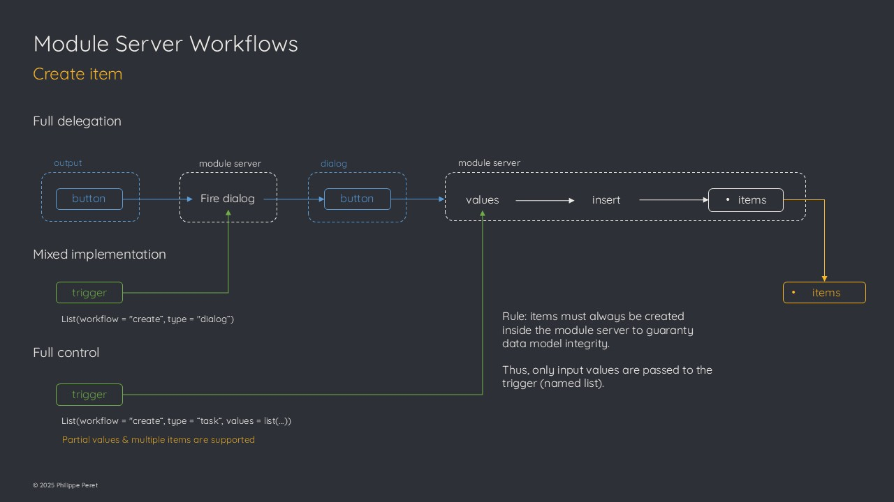

# Item workflows

One of the purpose of the module server is to offer flexible
implementation options.  
To support this key capability, specific workflows had to be implemented
when it comes to item management (create / update / delete operations).

This article focuses on these workflows and how to make use of them.

## Create item(s)

### Full delegation

The standard way to create items is to implement the create button
widget in the application UI.

When clicked by the user, the button will fire a creation dialog with
the input form.  
A confirmation button in this dialog is used to launch the creation
process based on the input values and the item is inserted in the item
table.

### Mixed implementation

Another way is to fire the create item dialog directly from the main
application server (it’s useful when you don’t want to implement the
create button in the application UI).

An event can be sent to the module trigger reactive argument:

``` r
list(workflow = "create", type = "dialog")
```

From there, the creation process will work the same way as it does after
the create button is clicked.

### Full control

The third and last option is to rely on a full server-side process.

This is particularly useful when the item creation does not rely on user
input, or when you want to implement your own input form.

A specific event is used to trigger this back-end creation process:

``` r
list(workflow = "create", type = "task", values = list(...))
```

The values are the ones to be used to create the new item.

- The names in the list should fit with the names of the attributes
  (otherwise they will be dropped)

- Partial value list is supported, meaning that the workflow will add
  missing attributes and take the values from the default defined in the
  data model

This back-end process also supports creating multiple items at once.

> **Important**
>
> If so, elements in the list *must* have either length 1 (all items
> will get same value for this attribute) or same length as the expected
> number of items. If not, the process will fail as it is not safe to
> guess whats the intention behind such a list.

In case existing ids are sent along the list, the corresponding items
will be skipped to avoid item duplication (it’s better to send a list
without id and let the data model generate them!).

### Schema



## Update item(s)

In the same way as for the create workflow, the update one offers three
types of implementations.

### Full delegation

The standard process to update an item is to select it in the item table
from the application UI.

This triggers the update button to be set visible. When the user clicks
on it, the update dialog window is displayed and is initialized with the
selected item’s values. After the user confirms the update, the input
values are used to update the corresponding attributes in the item
table. As usual, these values are checked against the data model and
replaced by defaults for example if the user lets an input empty.

Only a single item can be updated at a time.

### Mixed implementation

When the item table is not implemented in the application UI, the update
button cannot be used as it directly relies on the selected item.

In this case, it’s possible to use the server function `trigger`
argument to fire the update dialog for a specific item:

``` r
list(workflow = "update", type = "dialog", values = list(id = ...))
```

From there, the update process will be same as in the first
implementation.

### Full control

If the update process does not rely on user input (for example to update
an attribute linked to the lifecycle of the item such as progress or
state), or if you want to implement your own custom input form, then it
is possible to use the `trigger` in a full back-end update process.

The event is similar to the one used to create items, only the workflow
is different:

``` r
list(workflow = "update", type = "task", values = list(...))
```

The module will use the provided values to update the corresponding
items.

Again, partial values are supported, meaning that if you provide an id
with a single attribute, only this attribute will be updated for the
corresponding item.

It is possible to force the update of a computed value attribute by
including the name in the list, and set the value to `NA`. In this case,
the data model will be used to define the default value.

Multiple items update is supported as well, with same rules as for the
create workflow.

> **Note**
>
> Note that this back-end process is the only way to update multiple
> items at once.

### Schema


## Delete item(s)

### Full delegation

The standard way to delete items is from the application UI.

Whenever one or several items are selected in the item table, the delete
button is visible and can be used to fire the delete confirmation
dialog. Once the user hits the confirmation button in the dialog, the
items are deleted from the item table.

Multiple items delete is supported.

### Mixed implementation

Again here, when the item table is not implemented or if you want to
have the delete operation available from a contextual element attached
to a specific item (for example a marker’s popup on a map), the
`trigger` argument can be used to fire the delete confirmation dialog.

``` r
list(workflow = "delete", type = "dialog", values = list(id = c(...)))
```

User will hit the confirmation button and items will be removed from the
item table.

### Full control

In case you don’t want the confirmation dialog to pop up or need to use
a server side process that is not directly linked to the UI, the trigger
accepts a specific event that can be used to delete one or several
items:

``` r
list(workflow = "delete", type = "task", values = list(id = c(...)))
```

The module server will delete the items with corresponding ids.  
Of course if some id(s) are not retrieved, they will be ignored.

> **Caution**
>
> It is recommended that your application will secure delete with some
> confirmation process as the module server will not ask for any
> confirmation!
>
> This is particularly true when the autosave is set to `TRUE` as the
> item table will be saved as soon as it is modified.

### Schema


## Multiple events

Module server function `trigger` argument supports to get a list of
events (instead of a single event).

> **Note**
>
> The motivation behind this feature is explained in the known
> limitations (see
> [`vignette("limitations")`](https://thekangaroofactory.github.io/kitems/articles/limitations.md)
> ).

Single event examples:

``` r
list(workflow = "create", type = "task", values = list(name = "foo"))
list(workflow = "update", type = "task", values = list(id = 1234, name = "bar"))
```

Multiple events

``` r
list(
  list(workflow = "create", type = "task", values = list(name = "foo")),
  list(workflow = "update", type = "task", values = list(id = 1234, name = "bar"))))
```

The module server will take care of the events’ orchestration.

## Useful links

- default values: core concept / data model / default

- communication

- kitems()

- implementations
